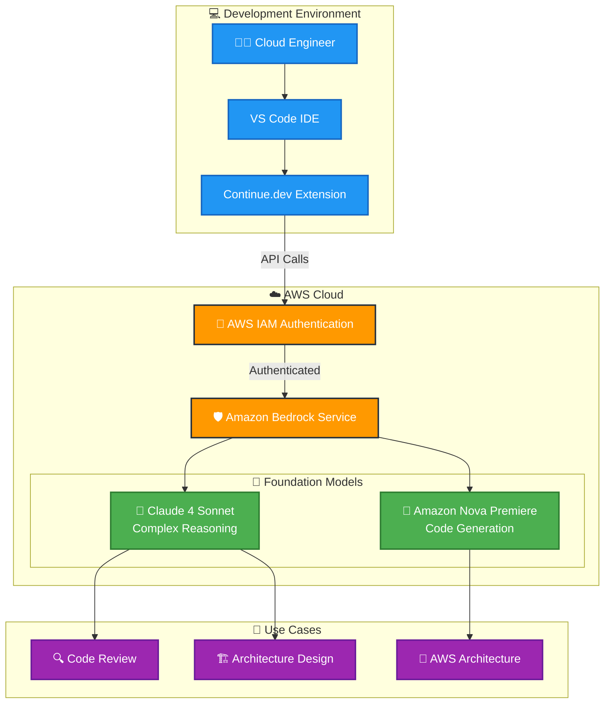
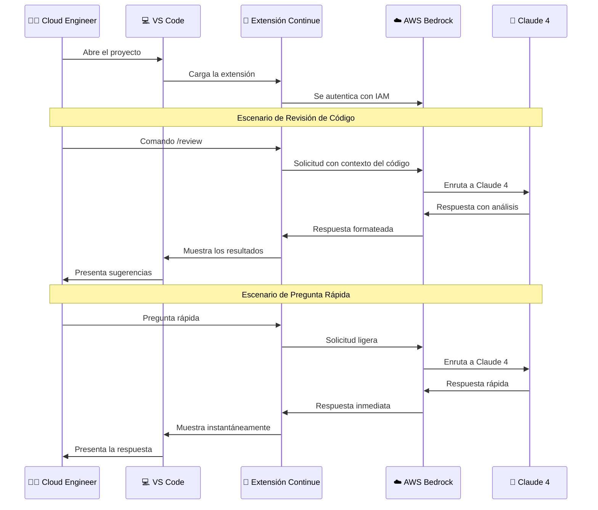

# ⚙️ Continue.dev Configuración Realizada

## 📋 Descripción

Este repositorio contiene mi configuración completa de **Continue.dev**, incluyendo el archivo `config.yml` personalizado y la construcción de asistentes especializados para diferentes tareas. La configuración está optimizada para maximizar la productividad en proyectos de DevOps y arquitectura cloud.

---

## 🎯 ¿Qué es Continue.dev?

**Continue.dev** es una extensión de VS Code que integra modelos de IA directamente en tu flujo de desarrollo.

---

## 🔗 Enlaces y Recursos

### **Continue.dev Official**
- 🌐 **Website:** [https://continue.dev](https://continue.dev)
- 📚 **Documentation:** [https://docs.continue.dev](https://docs.continue.dev)
- 🐙 **GitHub:** [https://github.com/continuedev/continue](https://github.com/continuedev/continue)
- 💬 **Discord Community:** [https://discord.gg/NWtdYexhMs](https://discord.gg/NWtdYexhMs)

---

## ☁️ Integración con Amazon Bedrock

### **🚀 ¿Por qué Amazon Bedrock?**

Esta configuración está diseñada para consumir **Amazon Bedrock** como proveedor principal de modelos de IA, lo que nos permite:

- 🔐 **Seguridad Enterprise**: Datos procesados en tu propia cuenta AWS
- 🌍 **Múltiples LLMs**: Acceso a diferentes modelos desde una sola API
- 💰 **Costo Optimizado**: Pago por uso sin suscripciones mensuales
- 🔒 **Compliance**: Cumple con regulaciones corporativas
- ⚡ **Baja Latencia**: Infraestructura AWS optimizada

### **🚀 Diagrama de Flujo de Arquitectura**

Este diagrama ilustra la arquitectura de un entorno de desarrollo basado en inteligencia artificial que integra herramientas locales con servicios de AWS. Un ingeniero de la nube utiliza VS Code con la extensión Continue.dev para conectarse de forma segura a Amazon Bedrock a través de autenticación IAM, accediendo así a modelos de lenguaje avanzados como Claude 4 Sonnet (especializado en razonamiento complejo) y Amazon Nova Premiere (optimizado para generación de código). Esta configuración permite aprovechar las capacidades de IA para casos de uso específicos como revisión de código, diseño de arquitecturas AWS y planificación de arquitecturas de sistemas, creando un flujo de trabajo eficiente que combina el desarrollo local con la potencia de los servicios de IA en la nube de Amazon.

### **🔄 Flujo de Interacción: Desarrollo Asistido por IA**

Este diagrama de secuencia detalla el flujo completo de comunicación entre un ingeniero de la nube y los servicios de IA de AWS durante el proceso de desarrollo. El proceso inicia cuando el desarrollador abre su proyecto en VS Code, activando automáticamente la extensión Continue que se autentica con AWS Bedrock mediante credenciales IAM. Una vez establecida la conexión, el sistema permite dos tipos principales de interacciones: revisiones de código profundas (donde el desarrollador ejecuta comandos como /review para obtener análisis detallados del código) y consultas rápidas para resolver dudas puntuales. En ambos casos, las solicitudes viajan desde VS Code a través de Continue hacia AWS Bedrock, que las enruta al modelo Claude 4 para su procesamiento, y las respuestas regresan por el mismo camino hasta presentarse al desarrollador de manera clara y contextualizada en su entorno de desarrollo.

