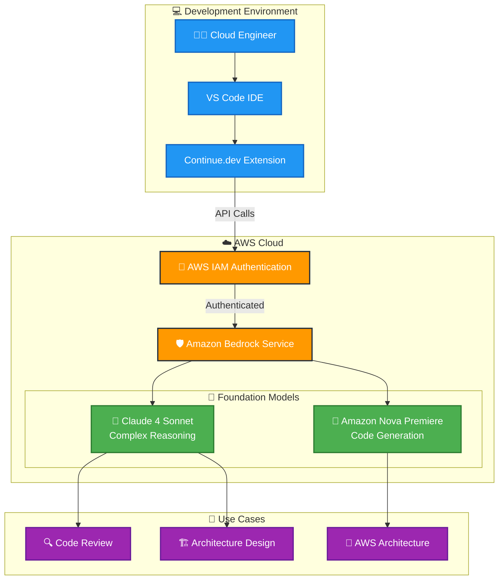

# ⚙️ Continue.dev Configuración Realizada

## 📋 Descripción

Este repositorio contiene mi configuración completa de **Continue.dev**, incluyendo el archivo `config.yml` personalizado y la construcción de asistentes especializados para diferentes tareas. La configuración está optimizada para maximizar la productividad en proyectos de DevOps y arquitectura cloud.

---

## 🎯 ¿Qué es Continue.dev?

**Continue.dev** es una extensión de VS Code que integra modelos de IA directamente en tu flujo de desarrollo.

---

## 🔗 Enlaces y Recursos

### **Continue.dev Official**
- 🌐 **Website:** [https://continue.dev](https://continue.dev)
- 📚 **Documentation:** [https://docs.continue.dev](https://docs.continue.dev)
- 🐙 **GitHub:** [https://github.com/continuedev/continue](https://github.com/continuedev/continue)
- 💬 **Discord Community:** [https://discord.gg/NWtdYexhMs](https://discord.gg/NWtdYexhMs)

---

## ☁️ Amazon Bedrock Integration

### **🚀 ¿Por qué Amazon Bedrock?**

Esta configuración está diseñada para consumir **Amazon Bedrock** como proveedor principal de modelos de IA, lo que nos permite:

- 🔐 **Seguridad Enterprise**: Datos procesados en tu propia cuenta AWS
- 🌍 **Múltiples LLMs**: Acceso a diferentes modelos desde una sola API
- 💰 **Costo Optimizado**: Pago por uso sin suscripciones mensuales
- 🔒 **Compliance**: Cumple con regulaciones corporativas
- ⚡ **Baja Latencia**: Infraestructura AWS optimizada

