# ⚙️ Continue.dev Configuración Realizada

## 📋 Descripción

Este repositorio contiene mi configuración completa de **Continue.dev**, incluyendo el archivo `config.yml` personalizado y la construcción de asistentes especializados para diferentes tareas. La configuración está optimizada para maximizar la productividad en proyectos de DevOps y arquitectura cloud.

---

## 🎯 ¿Qué es Continue.dev?

**Continue.dev** es una extensión de VS Code que integra modelos de IA directamente en tu flujo de desarrollo.

---

## 🔗 Enlaces y Recursos

### **Continue.dev Official**
- 🌐 **Website:** [https://continue.dev](https://continue.dev)
- 📚 **Documentation:** [https://docs.continue.dev](https://docs.continue.dev)
- 🐙 **GitHub:** [https://github.com/continuedev/continue](https://github.com/continuedev/continue)
- 💬 **Discord Community:** [https://discord.gg/NWtdYexhMs](https://discord.gg/NWtdYexhMs)

---

## ☁️ Amazon Bedrock Integration

### **🚀 ¿Por qué Amazon Bedrock?**

Esta configuración está diseñada para consumir **Amazon Bedrock** como proveedor principal de modelos de IA, lo que nos permite:

- 🔐 **Seguridad Enterprise**: Datos procesados en tu propia cuenta AWS
- 🌍 **Múltiples LLMs**: Acceso a diferentes modelos desde una sola API
- 💰 **Costo Optimizado**: Pago por uso sin suscripciones mensuales
- 🔒 **Compliance**: Cumple con regulaciones corporativas
- ⚡ **Baja Latencia**: Infraestructura AWS optimizada

```mermaid
graph TB
    subgraph "💻 Development Environment"
        A[👨‍💻 Cloud Engineer] --> B[VS Code IDE]
        B --> C[Continue.dev Extension]
    end
    
    subgraph "☁️ AWS Cloud"
        D[🔐 AWS IAM Authentication]
        E[🛡️ Amazon Bedrock Service]
        
        subgraph "🤖 Foundation Models"
            F1[🧠 Claude 4 Sonnet<br/>Complex Reasoning]
            F3[🧠 Amazon Nova Premiere<br/>Code Generation]

        end
    end
    
    subgraph "🎯 Use Cases"
        G1[🔍 Code Review]
        G2[🧪 AWS Architecture]
        G5[🏗️ Architecture Design]
    end
    
    %% Connections
    C -->|API Calls| D
    D -->|Authenticated| E
    E --> F1
    E --> F3


    
    F1 --> G1
    F1 --> G5
    F3 --> G2

    
    %% Styling
    classDef aws fill:#FF9900,stroke:#232F3E,stroke-width:2px,color:#fff
    classDef llm fill:#4CAF50,stroke:#2E7D32,stroke-width:2px,color:#fff
    classDef dev fill:#2196F3,stroke:#1565C0,stroke-width:2px,color:#fff
    classDef usecase fill:#9C27B0,stroke:#6A1B9A,stroke-width:2px,color:#fff
    
    class D,E aws
    class F1,F2,F3,F4,F5 llm
    class A,B,C dev
    class G1,G2,G3,G4,G5 usecase
```

```mermaid
sequenceDiagram
    participant Dev as 👨‍💻 Cloud Engineer
    participant VSCode as 💻 VS Code
    participant Continue as 🔌 Extensión Continue
    participant AWS as ☁️ AWS Bedrock
    participant Claude as 🧠 Claude 4
    
    Dev->>VSCode: Abre el proyecto
    VSCode->>Continue: Carga la extensión
    Continue->>AWS: Se autentica con IAM
    
    Note over Dev,Claude: Escenario de Revisión de Código
    Dev->>Continue: Comando /review
    Continue->>AWS: Solicitud con contexto del código
    AWS->>Claude: Enruta a Claude 4
    Claude->>AWS: Respuesta con análisis
    AWS->>Continue: Respuesta formateada
    Continue->>VSCode: Muestra los resultados
    VSCode->>Dev: Presenta sugerencias
    
    Note over Dev,Claude: Escenario de Pregunta Rápida  
    Dev->>Continue: Pregunta rápida
    Continue->>AWS: Solicitud ligera
    AWS->>Claude: Enruta a Claude 4
    Claude->>AWS: Respuesta rápida
    AWS->>Continue: Respuesta inmediata
    Continue->>VSCode: Muestra instantáneamente
    VSCode->>Dev: Presenta la respuesta
```

